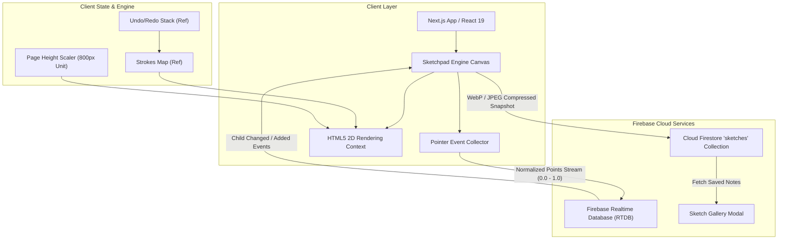
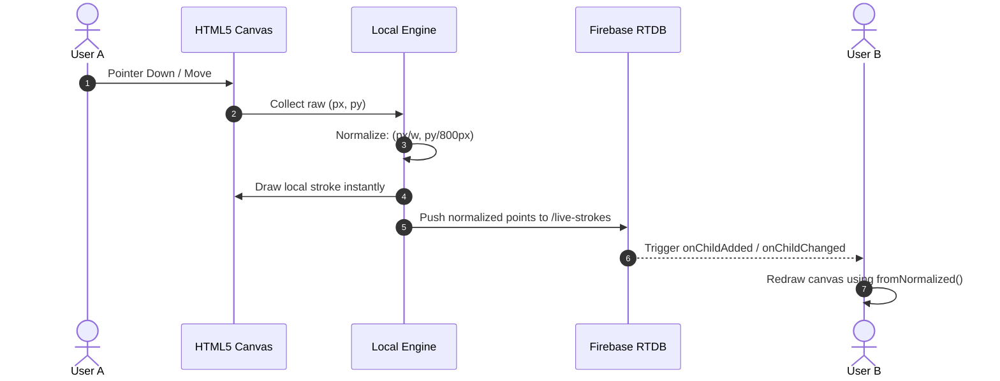
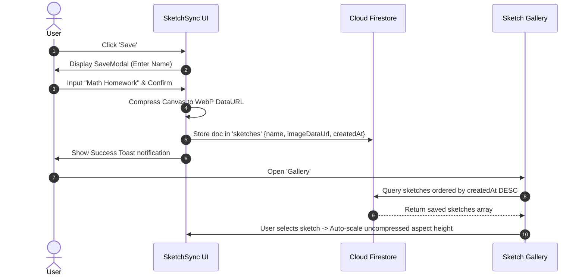

# 🎨 SketchSync — Real-Time Collaborative Educational Whiteboard & Notebook

> A production-ready, real-time collaborative digital sketchpad optimized for mathematical problem solving, note-taking, and visual brainstorming across multiple devices.

---

## 📌 Overview
**SketchSync** is an advanced digital whiteboard built for students, educators, and teams to solve complex mathematical problems, draw diagrams, and take long-form handwritten notes synchronously across devices. Powered by **Next.js 15 (App Router)** and **Firebase Realtime Database & Firestore**, SketchSync delivers zero-latency drawing synchronization, dynamic canvas extension, customizable background notebooks, persistent snapshot storage, and pixel-perfect stroke rendering.

---

## ✨ Key Features

### 🖋️ Drawing & Ergonomics
- **Real-Time Synchronous Strokes**: Sub-30ms stroke transmission using normalized resolution-independent coordinates (`0.0` to `1.0`).
- **Precision Pen & Eraser Tools**: Custom composite operations (`destination-out`) allow seamless pixel-level erasing without affecting background grids.
- **Custom Color & Thickness**: 12 curated color presets, custom HTML5 color picker, and 5 adjustable stroke weight levels.
- **Full Undo / Redo Engine**: Instant `Ctrl+Z` / `Ctrl+Y` keyboard shortcuts backed by a local stack manager.

### 📄 Infinite Multi-Page Canvas
- **Dynamic Page Extensions ("Add Page")**: Scrollable workspace with infinite page extensions.
- **Non-Distorting Scaling**: Normalizes coordinates relative to fixed page height units (`800px`), ensuring adding pages never stretches or distorts existing drawings.
- **Visual Page Dividers**: Clean dashed indicators (*"Page 1"*, *"Page 2"*, *"Page 3"*) to visually organize long mathematical derivations.

### 🎨 Custom Background Notebook Themes
- **6 Dynamic Background Patterns**: Switch between **White**, **Cream (Vintage)**, **Grid (Graph paper)**, **Lined (Notebook)**, **Dotted**, and **Dark Mode** seamlessly anytime.
- **Live Theme Sync**: Background pattern selections sync live across all connected collaborative sessions via Realtime Database.

### 💾 Persistent Storage & Custom Note Naming
- **Named Notebook Storage**: Save sketches with custom filenames (e.g., *"Calculus Chapter 3 Notes"*, *"Physics Problem 12"*).
- **Snapshot Compression**: Automated WebP / JPEG compression engine fits image snapshots efficiently within database payload limits.
- **Personal Sketch Gallery**: Interactive modal gallery to view, browse, and re-open saved notes with 1:1 aspect-ratio auto-scaling.
- **Unsaved Work Protection**: Confirmation modal prevents accidental loss of notes when starting a new notebook.

---

## 🛠️ Technology Stack

| Domain | Technology | Description |
| :--- | :--- | :--- |
| **Frontend Framework** | **Next.js 15 (App Router)** | React 19 server/client hybrid engine |
| **Language** | **TypeScript 5** | End-to-end static typing and interface safety |
| **Styling** | **Tailwind CSS v4** | Modern utility-first CSS design system |
| **Live Synchronization** | **Firebase Realtime Database (RTDB)** | Low-latency WebSocket stroke stream |
| **Persistent Storage** | **Cloud Firestore** | Document database for compressed note snapshots |
| **Icons & UI Elements** | **Lucide React** | Sleek, modern SVG icon library |

---

## 🏗️ System Architecture



---

## 🔄 System Process Flow

### 1. Real-Time Drawing Flow


### 2. Save & Load Notebook Flow


---

## 🚀 Getting Started & Installation

### 1. Prerequisites
- **Node.js**: 18.x or higher
- **npm** or **yarn**
- **Firebase Account** with Realtime Database & Firestore enabled

### 2. Clone Repository
```bash
git clone https://github.com/Gagan-Gautam-02/SketchPadPersonal.git
cd SketchPadPersonal
```

### 3. Install Dependencies
```bash
npm install
```

### 4. Configure Environment Variables
Create a `.env.local` file in the root directory (refer to `.env.local.example`):
```env
NEXT_PUBLIC_FIREBASE_API_KEY=your_api_key
NEXT_PUBLIC_FIREBASE_AUTH_DOMAIN=your_project.firebaseapp.com
NEXT_PUBLIC_FIREBASE_DATABASE_URL=https://your_project-default-rtdb.firebaseio.com
NEXT_PUBLIC_FIREBASE_PROJECT_ID=your_project_id
NEXT_PUBLIC_FIREBASE_STORAGE_BUCKET=your_project.appspot.com
NEXT_PUBLIC_FIREBASE_MESSAGING_SENDER_ID=your_sender_id
NEXT_PUBLIC_FIREBASE_APP_ID=your_app_id
```

### 5. Run Development Server
```bash
npm run dev
```
Open [http://localhost:3000](http://localhost:3000) in your browser.

---

## 🔒 Security & Privacy
- **Environment Isolation**: Sensitive credentials in `.env.local` are strictly excluded from Git via `.gitignore`.
- **Template Safety**: Only placeholder structures are stored in `.env.local.example`.

---

## 📄 License
Distributed under the MIT License. See `LICENSE` for more information.
